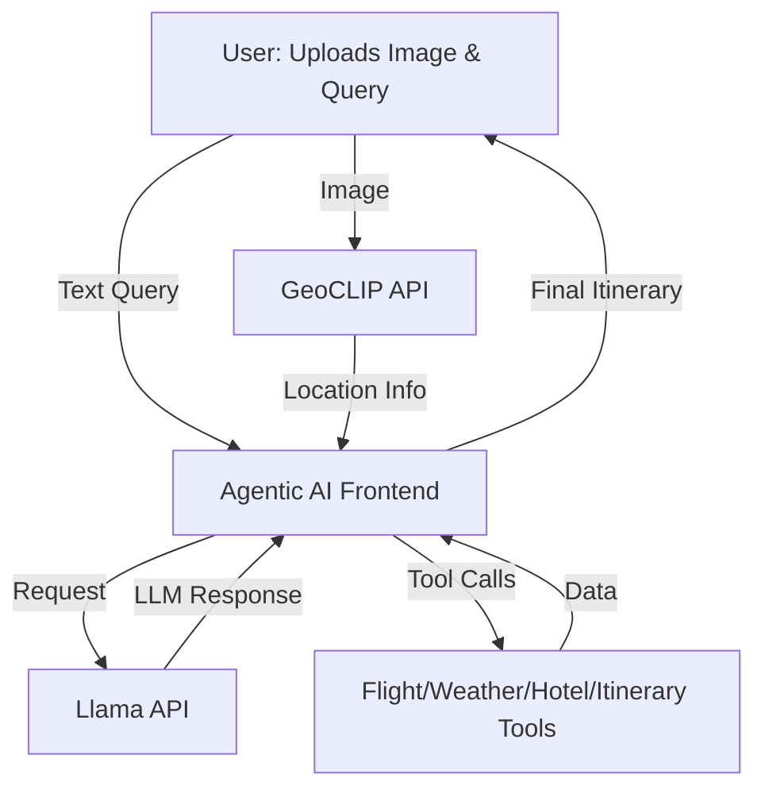
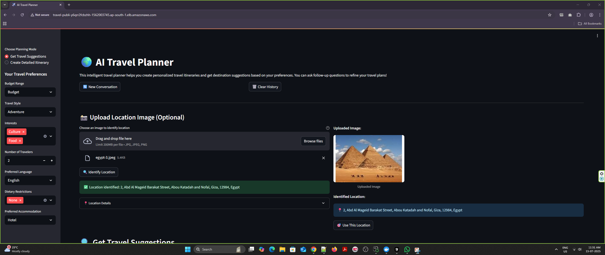
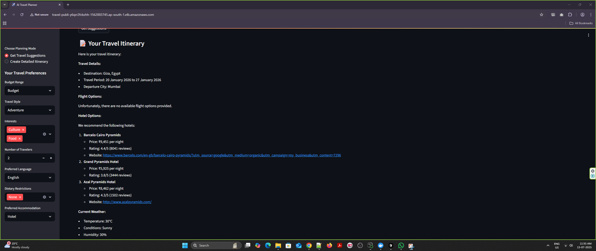

<div align="left">
  
  
  
</div>

# 🌏 ERA-V3 Capstone Project: Agentic AI Travel Planner

> **An extensive capstone project for The School of AI's ERA-V3 course, combining custom LLM training, image-based geolocation, and agentic AI for personalized travel planning.**

---

## 👥 Project Contributors

- **Saish Shetty**
- **Venkatesh Babu D.B.**
- **Arghya Mukherjee**
- **Tousif Ahamed**
- **Supreeth Kousika**

---

## 🚀 Project Overview

The AI Travel Planner is a full-stack, agentic AI application that enables users to create and plan their favorite travel itineraries. It leverages custom-trained Large Language Models (LLMs), image-based geolocation, and a suite of travel tools to deliver a seamless, interactive travel planning experience.

---

## 🧩 Main Components

### 1️⃣ `base_llm/` - Custom LLM Training
- **Train a 1-3B parameter LLM from scratch** on a large text dataset.
- Achieved successful training and deployment. ([Details](base_llm/SmolLM2-1.7B-Pre-Training/README.md))

### 2️⃣ `geoclip_api/` - Image-Based Geolocation API
- **GeoCLIP model API**: Accepts images, predicts geolocation with confidence scores.
- RESTful endpoints, reverse geocoding, and robust logging. ([Details](geoclip_api/README.md))

### 3️⃣ `llama_fine_tuning/` - Llama 3.1 8B Fine-Tuning & Serving
- **Two-stage fine-tuning**: Raw → Instruct → Travel Specialist (Indian context).
- API endpoints to serve the fine-tuned Llama model for downstream applications. ([Details](llama_fine_tuning/README.md))

### 4️⃣ `agentic_ai/` - Agentic AI Full-Stack Application
- **Frontend & Backend**: Streamlit UI + LangChain agent server.
- Backend agent powered by Llama API, with access to:
  - ✈️ FlightSearchTool
  - 🌦️ WeatherTool
  - 🏨 HotelSearchTool
  - 🗺️ ItineraryPlannerTool
- Supports text and image input; integrates with GeoCLIP and Llama APIs.
- Follow-up box for iterative itinerary refinement.
- Fallback to OpenRouter LLM API if Llama API fails.
- ([Details](agentic_ai/README.md))

---

## 🛣️ Code Execution Flow



---

## 📁 Project Directory Structure

```text
ERAV3-CapstoneProject/
├── agentic_ai/
│   ├── app.py
│   ├── run_app.py
│   ├── start.py
│   ├── requirements.txt
│   ├── README.md
│   ├── .env.example
│   ├── agents/
│   ├── tools/
│   │   ├── travel_tools.py
│   │   ├── travel_utils.py
│   │   ├── WeatherTool.py
│   │   ├── FlightSearchTool.py
│   │   └── CurrencyTool.py
│   ├── mcp_server/
│   ├── workflows/
│   ├── logs/
│   └── ...
├── base_llm/
│   ├── prepare_combined_dataset.py
│   ├── train_llama_local.py
│   ├── requirements.txt
│   ├── README.md
│   ├── my_llama_1b_run/
│   └── ...
├── geoclip_api/
│   ├── api.py
│   ├── api-gpu.py
│   ├── README.md
│   ├── requirements.txt
│   ├── .env.example
│   ├── logs/
│   └── ...
├── llama_fine_tuning/
│   ├── llama_api.py
│   ├── requirements.txt
│   ├── README.md
│   ├── logs/
│   └── ...
├── configs/
├── data/
├── scripts/
├── sft/
├── docker-compose.yml
├── requirements.txt
├── README.md  # This file
└── ...
```

---

## 🖼️ Sample Application Screenshots (on AWS ECS)

<div align="center">
  
  <br>
  
</div>

---

## 🌐 Live Demo

**URL:** [Agentic AI Travel Planner Application - Deployed on AWS](http://travel-publi-y6qrr2fcbzhh-1562003745.ap-south-1.elb.amazonaws.com/)

---

## ⚙️ Setup & Installation

### 1. Clone the Repository
```bash
git clone <repository-url>
cd ERAV3-CapstoneProject
```

### 2. Environment Setup
- Create Python environments and install dependencies for each major folder:
  - `base_llm/requirements.txt`
  - `geoclip_api/requirements.txt`
  - `llama_fine_tuning/requirements.txt`
  - `agentic_ai/requirements.txt`

### 3. API Keys & Environment Variables
- Add your API keys to `.env` files as described in each component's README.
  - `OPENROUTER_API_KEY`, `RAPID_API_KEY`, etc.

### 4. Start the Application

**Step 1: Start Llama API**
```bash
python llama_fine_tuning/llama_api.py
```

**Step 2: Start GeoCLIP API**
```bash
python geoclip_api/api-gpu.py
```

**Step 3: Start Agentic AI App**
```bash
python agentic_ai/start.py
```

> The Agentic AI app will connect to both APIs and launch the full-stack application.

---

## 🐳 Dockerized Deployment

- Each major folder contains a `Dockerfile` for containerized setup.
- Use `docker-compose.yml` for orchestrating multi-container deployment.

---

## 🛠️ Troubleshooting & Support

- **API Key Errors**: Ensure `.env` files are correctly set up.
- **Dependency Issues**: Run `pip install -r requirements.txt` in each folder.
- **Port Conflicts**: Change default ports or kill existing processes.
- **Logs**: Check `logs/` directories for detailed error info.
- **Fallback**: OpenRouter API is used if Llama API fails.

For further help:
- Review component-specific README files
- Check logs for error details
- Contact contributors via GitHub

---

## 📄 License

This project is part of the ERA-V3 Capstone Project for The School of AI. See individual component folders for license details.

---

## 🤝 Contributing

1. Fork the repository
2. Create a feature branch
3. Make your changes
4. Test thoroughly
5. Submit a pull request

---

## 🏅 Acknowledgments

- HuggingFace, LangChain, Streamlit, DeepSpeed, and the open-source community
- GeoCLIP authors for the geolocation model
- The School of AI (TSAI) for the ERA-V3 course

---

<div align="center">
  <b>🌟 Agentic AI Travel Planner: Bringing LLMs, Geolocation, and Agentic Reasoning to Real-World Travel! 🌟</b>
</div>
